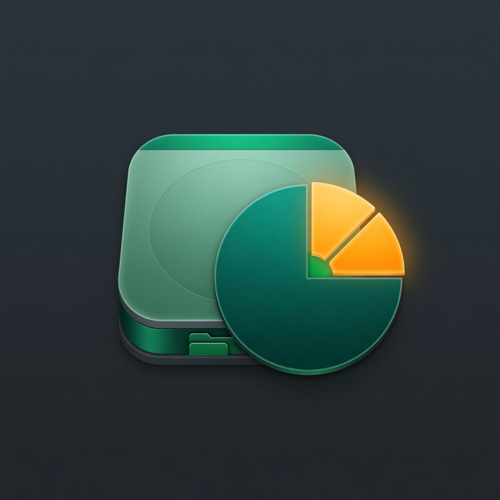

<p align="center">
  
</p>

<h1 align="center">Cistilka</h1>

<p align="center">
  <strong>Fast disk space analyzer for macOS</strong><br>
  Find what’s eating your storage. Clean up safely.
</p>

<p align="center">
  <a href="https://github.com/nodaysidle/nodaysidle-cistilka/releases/latest"></a>
  <a href="https://github.com/nodaysidle/nodaysidle-cistilka/releases/latest"></a>
  
  
  
</p>

<p align="center">
  <a href="#install">Install</a> ·
  <a href="#features">Features</a> ·
  <a href="#usage">Usage</a> ·
  <a href="#build-from-source">Build</a> ·
  <a href="#optional-cloud--ssh">Cloud &amp; SSH</a>
</p>

---

## Why Cistilka?

Your Mac fills up quietly — caches, old downloads, bloated `Library` folders, huge apps. **Cistilka** (Slovenian for *cleaner*) is a native **WizTree-style** space analyzer:

- Dense tree with **size**, **file counts**, and **% of parent**
- **File-type totals** so you can hunt `.mov`, `.dmg`, and friends
- **Move to Trash** (never silent permanent delete for local files)
- Scans large trees **without freezing** the UI
- Built for **local disks first** — cloud and SSH are optional extras

---

## Install

### Download (recommended)

1. Grab the latest **`.dmg`** from  
   **[Releases](https://github.com/nodaysidle/nodaysidle-cistilka/releases/latest)**
2. Open the DMG → drag **Cistilka** into **Applications**
3. First launch: right-click → **Open** if Gatekeeper warns (ad-hoc / Developer ID builds)

### Full Disk Access

For a complete **Home** scan:

1. **System Settings → Privacy & Security → Full Disk Access**
2. Enable **Cistilka**
3. Quit & relaunch → **Rescan**

---

## Features

| | |
|--|--|
| **Fast local scans** | Home, folders, volumes — concurrent walk, packages as leaves by default |
| **Dense tree UI** | Name · Items · Size · % Parent, breadcrumbs, search |
| **Type breakdown** | Extension totals for the current folder or whole scan |
| **Safe cleanup** | Confirm → Finder **Trash**; drag-to-trash bar; ⌘⌫ |
| **FDA coach** | Guides Full Disk Access when scans look incomplete |
| **Optional cloud** | Google Drive & OneDrive (OAuth + PKCE) when configured |
| **Optional SSH** | SFTP scan; remote trash path or typed `DELETE` confirm |

---

## Usage

1. Open **Cistilka**
2. **Scan Home** or **Scan folder or volume…**
3. Sort by size, expand big folders
4. Select junk → **Move to Trash** (or drop on the trash bar)
5. Empty Trash in Finder when you’re sure

Nothing is permanently deleted locally by Cistilka — only sent to Trash.

---

## Build from source

**Requirements:** macOS 14+, Swift 6.2+ / Xcode 16+

```bash
git clone https://github.com/nodaysidle/nodaysidle-cistilka.git
cd nodaysidle-cistilka

swift test
swift build

# Package .app (ad-hoc sign by default)
./Scripts/package_app.sh release

# Dev loop
./Scripts/compile_and_run.sh

# Create a release DMG
./Scripts/make_dmg.sh
```

Identity: `version.env` (`APP_NAME`, `BUNDLE_ID`, `VERSION`, `BUILD_NUMBER`).

---

## Optional: Cloud & SSH

Local scanning works with **zero** cloud setup.

<details>
<summary><strong>Google Drive / OneDrive</strong></summary>

Public OAuth clients + PKCE (no client secret in the app).

```bash
cp Config/OAuth.example.plist Config/OAuth.plist
# Edit GoogleClientID / MicrosoftClientID and redirect URIs
```

For packaged apps, place `OAuth.plist` in `Cistilka.app/Contents/Resources/` and re-sign.  
`Config/OAuth.plist` is gitignored.

Desktop Google clients typically use the reverse Client ID redirect form — see `Config/OAuth.example.plist`.

</details>

<details>
<summary><strong>SSH / SFTP</strong></summary>

**Settings → Accounts → Add SSH…**

- Password or key (Keychain)
- Optional remote trash path
- Without trash path: type `DELETE` to confirm permanent remove

</details>

---

## Safety

| Source | Remove action |
|--------|----------------|
| Local | Finder Trash only |
| Google Drive | Provider trash |
| OneDrive | Recycle bin |
| SSH + trash path | Rename into path |
| SSH without trash path | Permanent only after strong confirm |

---

## Project layout

```text
Sources/Cistilka/   App, UI, Scanner, Index, Auth, Removal
Tests/              Unit + integration tests
Scripts/            package_app.sh, make_dmg.sh, compile_and_run.sh
Config/             OAuth.example.plist
assets/             App icon artwork
docs/               Design & plan (superpowers)
```

---

## License

[MIT](LICENSE) · Built with ♥ by [nodaysidle](https://github.com/nodaysidle)
